# CompanyOS Complete ERD v1.0

Status: Approved — Gate 2
Date: 2026-08-29
Approved: 2026-08-29
Scope: Core Platform, CRM, Sales, HR
Normative authorization input: `04-engineering/security/rbac-resource-permission-matrix-v1.0.md` (Approved Gate 1)

## 1. Purpose

This document defines the complete logical data model for CompanyOS v1.0. It covers canonical transactional entities, required association/version/history entities, derived operational projections, tenant boundaries, module ownership, lifecycle, retention, and cross-domain references.

This ERD is normative for the PostgreSQL Schema. Physical PostgreSQL types, indexes, RLS, triggers, database roles, and migration implementation are deferred to Gate 3.

## 2. Normative References

- CompanyOS Product Blueprint v1.0
- CompanyOS Architecture Overview v1.0
- ADR-003 through ADR-013
- CompanyOS Core Domain Model v1.0
- CompanyOS Domain Boundaries v1.0
- CompanyOS Domain Invariants v1.0
- CompanyOS RBAC and Resource Permission Matrix v1.0 (Approved Gate 1)

## 3. Global Modeling Conventions

### 3.1 Identifiers and Tenancy

- Every durable entity has an opaque, globally unique `id`.
- Every tenant-owned entity carries `tenant_id`, either directly or through an immutable identifying parent where explicitly marked `parent-bound`.
- Tenant-owned foreign keys MUST enforce same-tenant references in the physical schema.
- Human-readable keys such as permission key, plugin key, object type key, document number, and employee number are alternate keys, not primary keys.
- Cross-tenant foreign keys and cross-tenant business relationships are prohibited.
- Platform catalog entities are marked `platform`; all others are `tenant` or `parent-bound`.

### 3.2 Common Columns

Unless explicitly excluded, mutable canonical entities contain:

- `id`
- `tenant_id` when tenant-owned
- `created_at`, `created_by`
- `updated_at`, `updated_by`
- `version` for optimistic concurrency

Lifecycle entities additionally contain `status` and relevant effective timestamps. Archivable entities contain `archived_at` and `archived_by`; they are not physically deleted during ordinary operations.

Immutable event, audit, published-version, decision, revision, and history entities contain creation/occurrence metadata but no ordinary update metadata.

### 3.3 Resource Registry

`core.resource` is the integrity anchor for generic CompanyOS resources. Each securable canonical aggregate root has exactly one resource row with:

- tenant;
- registered resource type;
- owning module;
- concrete aggregate ID;
- authorization projection attributes;
- lifecycle state and version.

Generic features such as comments, attachments, activities, workflow bindings, audit subjects, subscriptions, and cross-module relationships reference `resource_id`, not an unconstrained `(resource_type, resource_id)` pair.

Rules:

1. `core.resource_type` defines one owner module, permission namespace, and projection contract.
2. `(tenant_id, resource_type_id, concrete_id)` is unique.
3. The owning module MUST create/update the resource row transactionally with the concrete aggregate.
4. A resource row cannot exist without a registered type and owning aggregate; physical enforcement uses module-specific registration constraints/triggers defined at Gate 3.
5. Authorization projection attributes accelerate filtering but are derived from canonical ownership/scope data and MUST be transactionally synchronized or fail closed.
6. Generic references do not authorize access; approved RBAC evaluation still applies.

### 3.4 Canonical, Immutable, and Derived Data

| Class | Meaning | Mutation rule |
|---|---|---|
| `C` Canonical | System-of-record business/configuration data | Controlled create/update/archive through owner module. |
| `I` Immutable | Published version, event, audit, decision, revision, or history fact | Insert-only after creation/publish. |
| `D` Derived | Rebuildable projection, delivery state, or search/authorization helper | May be rebuilt from canonical sources. |
| `S` Sensitive canonical | Canonical data requiring additional field/resource controls | Same as canonical plus restricted read/audit policy. |

### 3.5 Module Ownership

- Core modules own reusable primitives and their tables.
- CRM, Sales, and HR own private business tables.
- A module can hold a foreign key to a public Core identity/resource contract.
- One business plugin MUST NOT foreign-key directly to another plugin's private table. Cross-plugin references use `core.resource` and public contracts/events.
- Core MUST NOT foreign-key to plugin-private tables.

### 3.6 Deletion and Retention

- Ordinary deletion is archive-first.
- Security/audit events, approval decisions, published workflow versions, document revisions, domain events, and outbox payload facts are append-only.
- Identity credentials and sessions may be revoked and later purged under security retention policy without deleting attributable audit facts.
- Hard deletion is allowed only for explicitly erasable data, failed/quarantined uploads, or retention jobs with policy authority.
- Parent deletion MUST NOT cascade into audit, event, approval decision, or material history loss.
- Legal retention durations and jurisdiction-specific erasure remain policy inputs for Gate 3 notes.

## 4. Cross-Domain Context Map

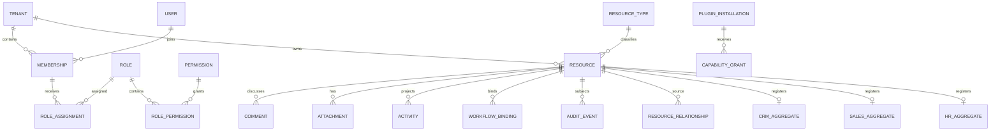

`CRM_AGGREGATE`, `SALES_AGGREGATE`, and `HR_AGGREGATE` are diagram aliases representing plugin-owned aggregate roots; they are not physical entities.

## 5. Foundation and Identity ERD

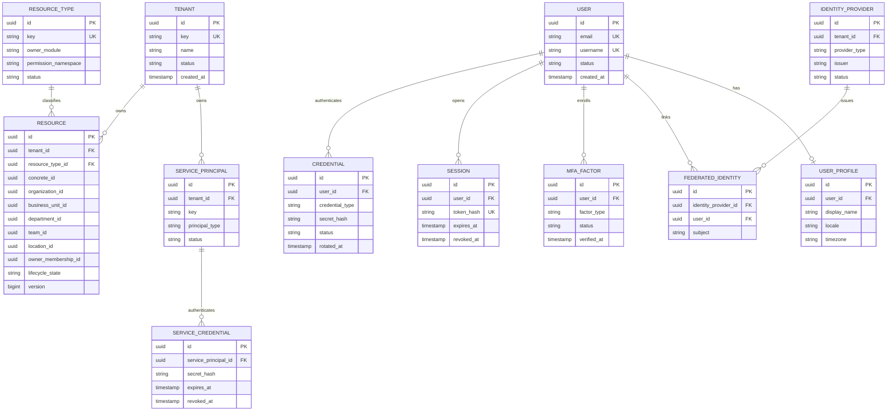

## 6. Organization ERD

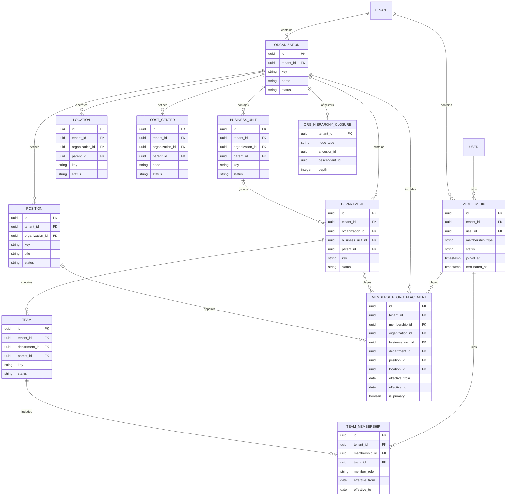

## 7. Authorization ERD

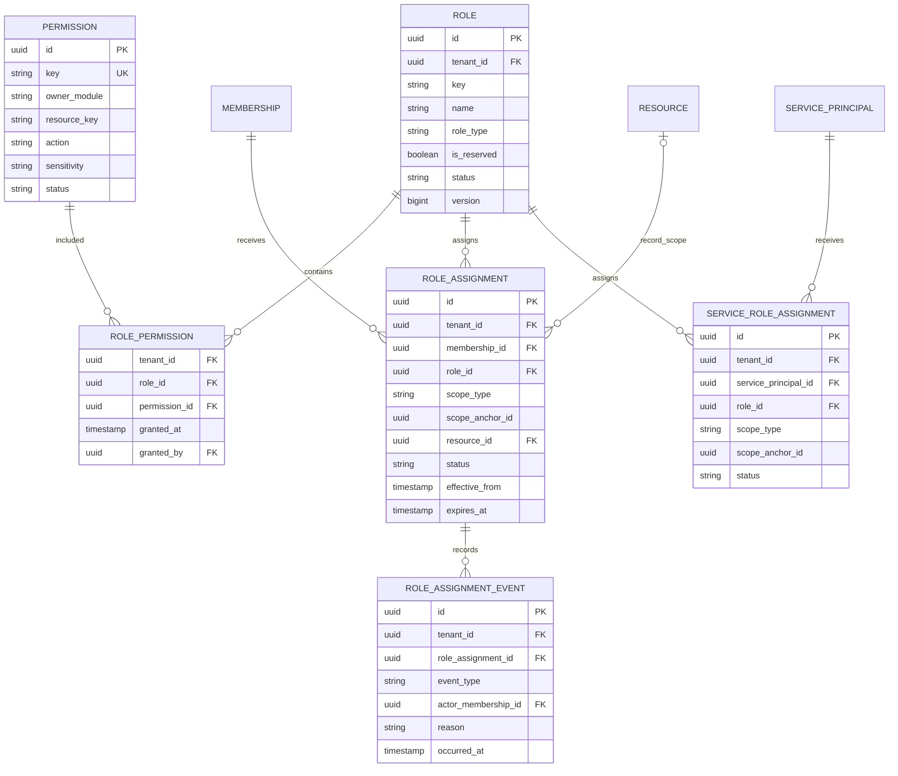

The polymorphic organizational `scope_anchor_id` is constrained by `scope_type` and same-tenant scope-anchor validation. `record` scope uses the concrete `resource_id` FK. Gate 3 MUST implement an enforceable scope anchor strategy; free-form UUIDs are not acceptable.

## 8. Core Data and Search ERD

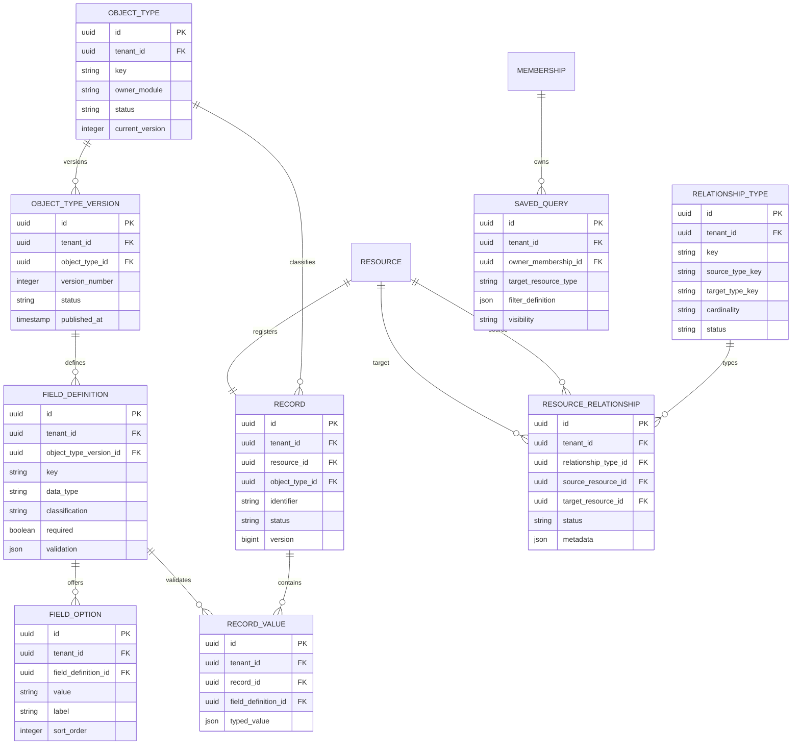

`RECORD_VALUE.typed_value` is a logical discriminated value, not an unrestricted schema escape hatch. Gate 3 MUST choose typed physical storage and enforce exactly one value compatible with the published field definition.

## 9. Work ERD

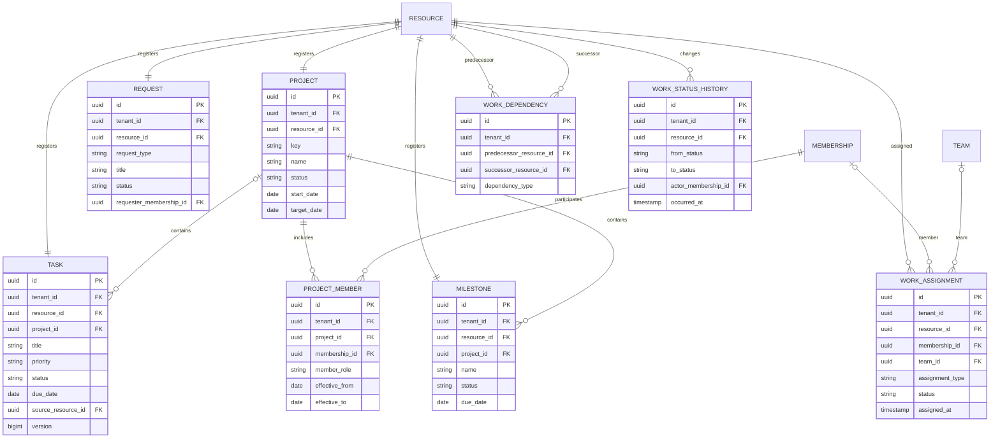

## 10. Workflow and Approval ERD

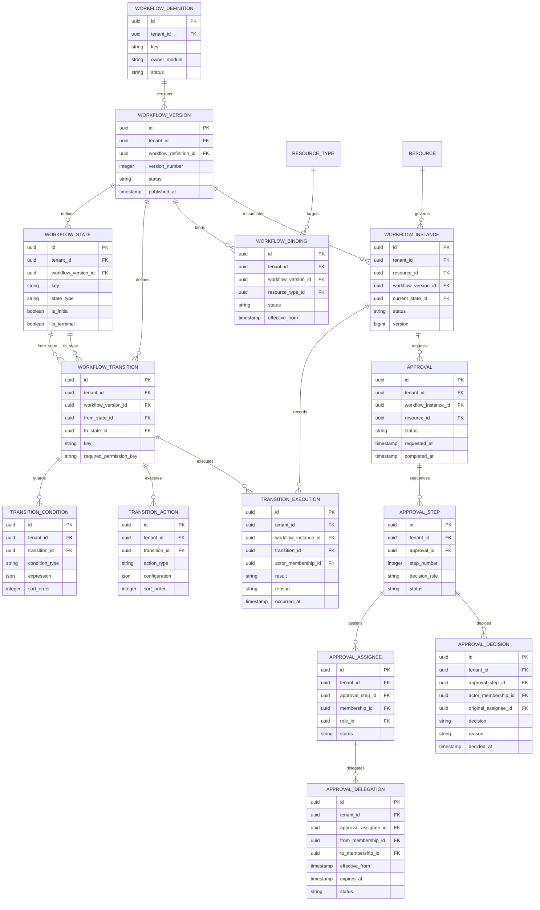

Published workflow definitions and all child states, transitions, conditions, and actions are immutable. Runtime instances always reference one published version.

## 11. Content ERD

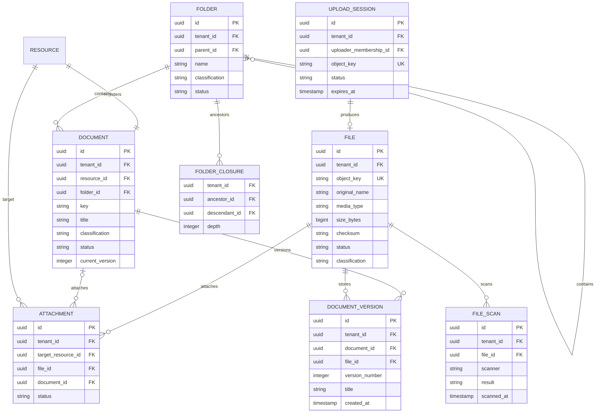

An attachment references exactly one of `file_id` or `document_id`. Binary data remains in S3-compatible object storage; PostgreSQL stores metadata and integrity references only.

## 12. Communication ERD

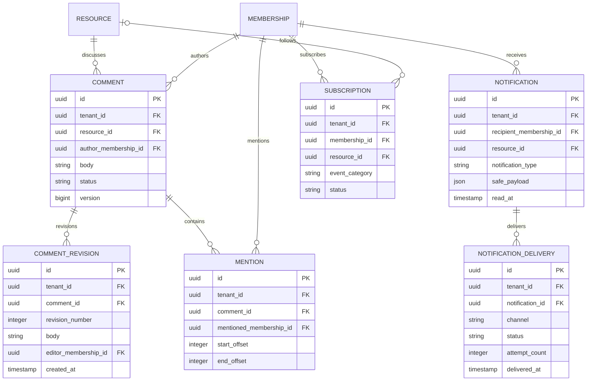

## 13. Automation ERD

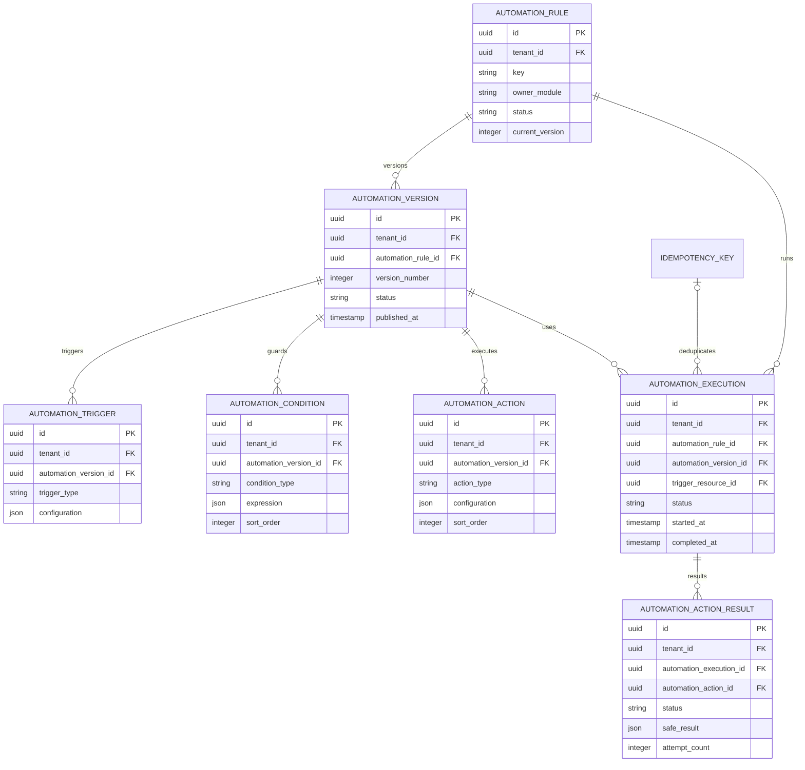

Published automation versions and their trigger/condition/action children are immutable. Secrets in configuration are stored as references, never embedded values.

## 14. Activity, Audit, Event, and Reliability ERD

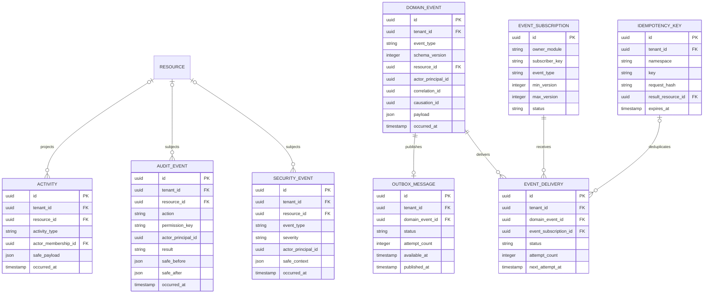

Audit, security, domain event, and activity facts are insert-only. Outbox/delivery operational status is mutable, but its event identity and payload reference are immutable.

## 15. Plugin, Configuration, and Integration ERD

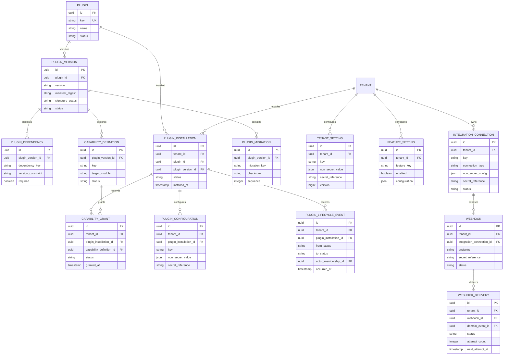

Catalog entities through `PLUGIN_MIGRATION` are platform-scoped unless explicitly tied to `PLUGIN_INSTALLATION`. Tenant configuration and secret references never contain raw secrets.

## 16. CRM ERD

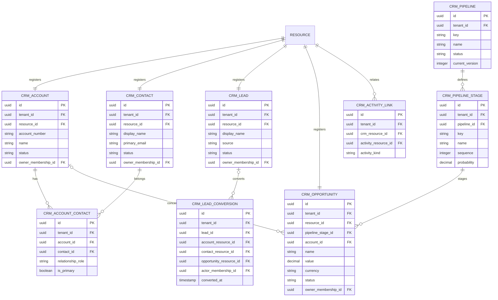

Lead conversion targets are `core.resource` references so CRM does not directly depend on Sales-private tables. The conversion transaction validates target resource types.

## 17. Sales ERD

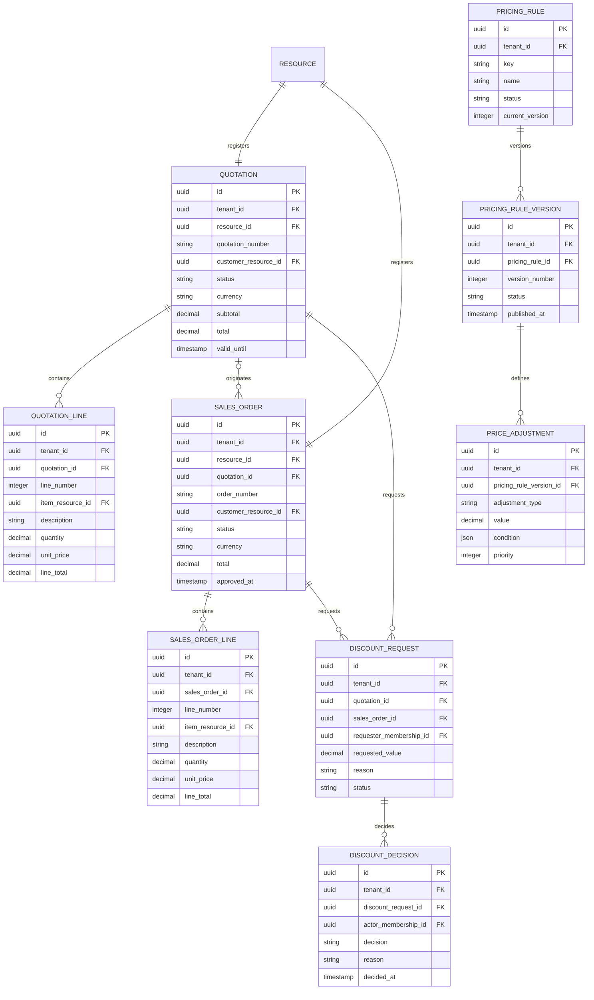

A discount request references exactly one quotation or sales order. Customer and item links use registered resources and public module contracts; Sales does not depend on CRM or Inventory private tables.

## 18. HR ERD

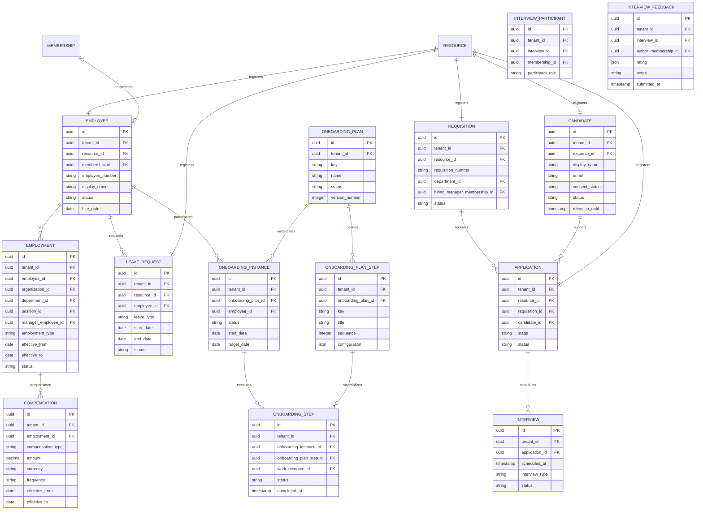

Compensation is a separate restricted aggregate. Tenant Administrator receives no implicit read path. Interview feedback visibility is independent from candidate/application base visibility.

## 19. Entity Register

The register is authoritative for ownership, classification, tenancy, lifecycle, and retention. Diagram aliases are excluded.

### 19.1 Foundation, Identity, Organization, Authorization

| Entity | Owner | Class | Tenant rule | Alternate key / lifecycle | Retention |
|---|---|---|---|---|---|
| `tenant` | Core/Foundation | C | platform root | `key`; provisioning → active → suspended → closed | Retain business/audit anchor. |
| `resource_type` | Core/Foundation | C | platform | `key`; registered → active → retired | Never reuse key. |
| `resource` | Core/Foundation | C/D projection | tenant | type + concrete ID; active → archived | Retain while referenced. |
| `user` | Identity | S | platform identity | normalized email/username; invited → active → suspended → closed | Privacy/security policy. |
| `credential` | Identity | S | platform identity | type per user; active → rotated/revoked | Purge secret after retention. |
| `session` | Identity | S | platform identity + tenant context | token hash; active → expired/revoked | Short security retention. |
| `mfa_factor` | Identity | S | platform identity | factor key; pending → active → revoked | Purge secrets after revocation. |
| `identity_provider` | Identity | S | tenant | issuer/client key; active → disabled | Retain config audit. |
| `federated_identity` | Identity | S | tenant/provider-bound | provider + subject; active → unlinked | Retain link history safely. |
| `user_profile` | Identity | C | platform identity | one per user | Erasable subject to audit. |
| `service_principal` | Identity | S | tenant | tenant + key; active → disabled | Retain identity audit. |
| `service_credential` | Identity | S | parent-bound | credential fingerprint; active → expired/revoked | Purge secret material. |
| `organization` | Organization | C | tenant | tenant + key; active → archived | Archive; retain references. |
| `business_unit` | Organization | C | tenant | organization + key; active → archived | Archive; retain hierarchy. |
| `department` | Organization | C | tenant | organization + key; active → archived | Archive; retain hierarchy. |
| `team` | Organization | C | tenant | department + key; active → archived | Archive; retain history. |
| `position` | Organization | C | tenant | organization + key; active → archived | Archive. |
| `location` | Organization | C | tenant | organization + key; active → archived | Archive. |
| `cost_center` | Organization | C | tenant | organization + code; active → archived | Archive. |
| `membership` | Organization | C | tenant | tenant + user; invited → active → suspended → terminated | Retain attribution. |
| `membership_org_placement` | Organization | I/effective | tenant | member + interval + primary | Retain employment/org history. |
| `team_membership` | Organization | I/effective | tenant | member + team + interval | Retain access history. |
| `org_hierarchy_closure` | Organization | D | tenant | node type + ancestor + descendant | Rebuildable. |
| `permission` | Authorization | C | platform registry | permission key; active → retired | Never reuse key. |
| `role` | Authorization | C | tenant | tenant + key; active → archived | Retain assignment references. |
| `role_permission` | Authorization | C | tenant | role + permission | Retain grant audit separately. |
| `role_assignment` | Authorization | C | tenant | member + role + scope + interval; pending → active → suspended/expired/revoked | Retain permanently for access audit. |
| `service_role_assignment` | Authorization | C | tenant | service + role + scope; active → revoked | Retain permanently for access audit. |
| `role_assignment_event` | Authorization | I | tenant | event ID | Append-only. |

### 19.2 Core Data, Work, Workflow

| Entity | Owner | Class | Tenant rule | Alternate key / lifecycle | Retention |
|---|---|---|---|---|---|
| `object_type` | Core Data | C | tenant | tenant + owner + key; draft → active → archived | Retain schema identity. |
| `object_type_version` | Core Data | I | tenant | object type + version; draft → published/retired | Published immutable. |
| `field_definition` | Core Data | I when published | parent-bound | version + key | Retain with object version. |
| `field_option` | Core Data | I when published | parent-bound | field + value | Retain with field. |
| `record` | Core Data | C | tenant | object type + identifier; active → archived/deleted-by-policy | Policy-based. |
| `record_value` | Core Data | C | tenant | record + field | Follows record retention. |
| `relationship_type` | Core Data | C | tenant | tenant + key; active → archived | Retain relationship semantics. |
| `resource_relationship` | Core Data | C | tenant | type + endpoints; active → archived | Retain material links. |
| `saved_query` | Search | C | tenant | owner + name | Delete with owner policy. |
| `task` | Work | C | tenant | optional task key; state machine | Archive; retain material work. |
| `project` | Work | C | tenant | tenant + key; planned → active → completed/archived | Retain project history. |
| `project_member` | Work | I/effective | tenant | project + member + interval | Retain participation history. |
| `milestone` | Work | C | tenant | project + name/key; planned → reached/cancelled | Retain. |
| `request` | Work | C | tenant | request number; workflow lifecycle | Retain by request policy. |
| `work_assignment` | Work | C/history | tenant | resource + assignee + type + interval | Retain attribution. |
| `work_dependency` | Work | C | tenant | predecessor + successor + type | Archive with work. |
| `work_status_history` | Work | I | tenant | history ID | Append-only. |
| `workflow_definition` | Workflow | C | tenant | tenant + owner + key; draft → active → archived | Retain identity. |
| `workflow_version` | Workflow | I when published | tenant | definition + version; draft → published/retired | Published immutable. |
| `workflow_state` | Workflow | I when published | parent-bound | version + key | Retain with version. |
| `workflow_transition` | Workflow | I when published | parent-bound | version + key | Retain with version. |
| `transition_condition` | Workflow | I when published | parent-bound | transition + order | Retain with version. |
| `transition_action` | Workflow | I when published | parent-bound | transition + order | Retain with version. |
| `workflow_binding` | Workflow | C/effective | tenant | resource type + effective interval | Retain binding history. |
| `workflow_instance` | Workflow | C | tenant | resource + workflow instance | Retain lifecycle state. |
| `transition_execution` | Workflow | I | tenant | execution ID | Append-only. |
| `approval` | Workflow | C | tenant | workflow instance + request | Retain decision process. |
| `approval_step` | Workflow | C | parent-bound | approval + step number | Retain. |
| `approval_assignee` | Workflow | C/history | tenant | step + assignee | Retain attribution. |
| `approval_decision` | Workflow | I/S | tenant | decision ID | Append-only. |
| `approval_delegation` | Workflow | I/effective | tenant | assignee + interval | Append-only lifecycle events. |

### 19.3 Content, Communication, Automation, Observability

| Entity | Owner | Class | Tenant rule | Alternate key / lifecycle | Retention |
|---|---|---|---|---|---|
| `file` | Content | S | tenant | object key/checksum; quarantined → available → archived/deleted | Object/data retention policy. |
| `file_scan` | Content | I | tenant | file + scanner + scan time | Security retention. |
| `document` | Content | S | tenant | tenant + key; draft → active → archived | Business retention. |
| `document_version` | Content | I/S | tenant | document + version | Immutable; business retention. |
| `folder` | Content | C | tenant | parent + normalized name; active → archived | Archive. |
| `folder_closure` | Content | D | tenant | ancestor + descendant | Rebuildable. |
| `attachment` | Content | C | tenant | target + source | Retain association/history. |
| `upload_session` | Content | S | tenant | object key; initiated → uploaded → validated/expired | Short retention if incomplete. |
| `comment` | Communication | C | tenant | comment ID; active → archived | Parent policy. |
| `comment_revision` | Communication | I | tenant | comment + revision | Immutable. |
| `mention` | Communication | C | tenant | comment + member + offsets | Follows comment. |
| `notification` | Communication | D | tenant | recipient + event reference | Configurable short retention. |
| `notification_delivery` | Communication | D | tenant | notification + channel | Operational retention. |
| `subscription` | Communication | C | tenant | member + resource/category; active → archived | Delete/archive with member. |
| `automation_rule` | Automation | C | tenant | tenant + key; draft → enabled/disabled/archived | Retain identity. |
| `automation_version` | Automation | I when published | tenant | rule + version | Published immutable. |
| `automation_trigger` | Automation | I when published | parent-bound | version + trigger key | Retain with version. |
| `automation_condition` | Automation | I when published | parent-bound | version + order | Retain with version. |
| `automation_action` | Automation | I when published | parent-bound | version + order | Retain with version. |
| `automation_execution` | Automation | C/history | tenant | execution ID; queued → running → succeeded/failed/cancelled | Operational/audit retention. |
| `automation_action_result` | Automation | C/history | tenant | execution + action | Operational retention. |
| `activity` | Activity | I/D | tenant | activity ID | Append-only; may be reconstructable. |
| `audit_event` | Audit | I/S | tenant | event ID | Append-only security/business retention. |
| `security_event` | Audit | I/S | tenant or platform | event ID | Append-only security retention. |
| `domain_event` | Event | I | tenant | event ID | Append-only according to event retention. |
| `outbox_message` | Event | C operational + immutable payload ref | tenant | domain event; pending → published/dead | Retain delivery evidence. |
| `event_subscription` | Event | C | platform/module | subscriber + event type + version range | Retain compatibility history. |
| `event_delivery` | Event | C operational | tenant | event + subscription; pending → delivered/dead | Operational retention. |
| `idempotency_key` | Reliability | C/D | tenant | namespace + key | Bounded expiry after replay window. |

### 19.4 Plugin, Configuration, Integration

| Entity | Owner | Class | Tenant rule | Alternate key / lifecycle | Retention |
|---|---|---|---|---|---|
| `plugin` | Plugin | C | platform | plugin key; available → deprecated | Retain catalog identity. |
| `plugin_version` | Plugin | I | platform | plugin + semantic version | Immutable manifest. |
| `plugin_dependency` | Plugin | I | parent-bound | version + dependency | Retain with version. |
| `capability_definition` | Plugin | I | parent-bound | version + key | Retain with version. |
| `plugin_installation` | Plugin | C | tenant | tenant + plugin; installed → enabled → active → disabled/uninstalled | Retain lifecycle history. |
| `capability_grant` | Plugin | C/history | tenant | installation + capability; active → revoked | Retain security history. |
| `plugin_configuration` | Plugin | S | tenant | installation + key | Retain non-secret history as policy requires. |
| `plugin_migration` | Plugin | I | platform | plugin version + migration key | Permanent checksum record. |
| `plugin_lifecycle_event` | Plugin | I | tenant | event ID | Append-only. |
| `tenant_setting` | Configuration | S | tenant | tenant + key | Version/audit history. |
| `feature_setting` | Configuration | C | tenant | tenant + feature key | Version/audit history. |
| `integration_connection` | Integration | S | tenant | tenant + key; active → disabled/archived | Retain metadata; purge secret. |
| `webhook` | Integration | S | tenant | connection + endpoint key; active → disabled | Retain config audit. |
| `webhook_delivery` | Integration | C operational | tenant | webhook + event | Operational retention. |

### 19.5 CRM, Sales, HR

| Entity | Owner | Class | Tenant rule | Alternate key / lifecycle | Retention |
|---|---|---|---|---|---|
| `crm_account` | CRM | C | tenant | account number; active → archived | CRM policy. |
| `crm_contact` | CRM | S | tenant | optional external key; active → archived/erased-by-policy | Personal-data policy. |
| `crm_account_contact` | CRM | C | tenant | account + contact + role | Follows endpoints/history. |
| `crm_lead` | CRM | S | tenant | lead key; new → qualified/disqualified/converted | CRM/privacy policy. |
| `crm_lead_conversion` | CRM | I | tenant | lead (one successful conversion) | Permanent material history. |
| `crm_pipeline` | CRM | C | tenant | tenant + key; draft → published/archived | Retain versions/stages used. |
| `crm_pipeline_stage` | CRM | I when published | parent-bound | pipeline + key | Retain referenced stages. |
| `crm_opportunity` | CRM | C | tenant | opportunity key; staged → won/lost/archived | CRM policy. |
| `crm_activity_link` | CRM | C | tenant | CRM resource + activity resource | Retain with activity. |
| `quotation` | Sales | C | tenant | quotation number; draft → issued → accepted/rejected/expired/archived | Commercial retention. |
| `quotation_line` | Sales | C | parent-bound + tenant | quotation + line number | Follows quotation. |
| `sales_order` | Sales | C | tenant | order number; draft → approved → processing → completed/cancelled | Commercial/legal retention. |
| `sales_order_line` | Sales | C | parent-bound + tenant | order + line number | Follows order. |
| `pricing_rule` | Sales | C | tenant | tenant + key; draft → active/archived | Retain identity. |
| `pricing_rule_version` | Sales | I when published | tenant | rule + version | Published immutable. |
| `price_adjustment` | Sales | I when published | parent-bound | version + priority/key | Retain with version. |
| `discount_request` | Sales | S | tenant | request ID; pending → approved/rejected/cancelled | Commercial audit retention. |
| `discount_decision` | Sales | I/S | tenant | decision ID | Append-only. |
| `employee` | HR | S | tenant | employee number; pending → active → inactive/archived | Employment/privacy policy. |
| `employment` | HR | S/effective | tenant | employee + interval | Long-term employment record. |
| `compensation` | HR | S/effective | tenant | employment + type + interval | Restricted statutory retention. |
| `leave_request` | HR | S | tenant | request ID; draft → submitted → approved/rejected/cancelled | HR retention. |
| `requisition` | HR | S | tenant | requisition number; draft → open → filled/closed | Recruitment retention. |
| `candidate` | HR | S | tenant | candidate ID; active → archived/erased | Consent/retention deadline. |
| `application` | HR | S | tenant | requisition + candidate; staged → hired/rejected/withdrawn | Recruitment retention. |
| `interview` | HR | S | tenant | application + schedule | Recruitment retention. |
| `interview_participant` | HR | S | tenant | interview + member | Recruitment retention. |
| `interview_feedback` | HR | S/I after submit | tenant | interview + author | Restricted, immutable after submit except governed correction. |
| `onboarding_plan` | HR | C/versioned | tenant | tenant + key + version; draft → published/retired | Published immutable. |
| `onboarding_plan_step` | HR | I when published | parent-bound | plan + key | Retain with plan. |
| `onboarding_instance` | HR | S | tenant | employee + plan instance; pending → active → completed/cancelled | HR retention. |
| `onboarding_step` | HR | S | tenant | instance + plan step | HR/work retention. |

## 20. Cardinality and Optionality Rules

1. A User has zero or more Memberships; a Membership belongs to exactly one User and one Tenant.
2. A User can have at most one Membership per Tenant in v1.0.
3. A Membership can have multiple effective placements, but at most one primary placement at a given time.
4. Organization, Business Unit, Department, Team, Location, Cost Center, and Folder parent links are optional at root and acyclic.
5. A Role Assignment belongs to exactly one Membership and Role and has exactly one validated scope.
6. A Resource has exactly one Resource Type and Tenant; a securable aggregate root has exactly one Resource.
7. Resource Relationships connect two distinct same-tenant Resources valid for the declared Relationship Type.
8. A Record Value belongs to exactly one Record and one compatible Field Definition.
9. A published Workflow Version has exactly one initial state and one or more states; transitions connect states in that same version.
10. A Workflow Instance references exactly one Resource and one published Workflow Version.
11. An Approval belongs to one Workflow Instance and target Resource; a Decision belongs to one Approval Step and authorized actor.
12. A Document Version references one Document and one available File.
13. An Attachment references exactly one target Resource and exactly one source File or Document.
14. A Comment belongs to exactly one Resource; a Mention belongs to one Comment and same-tenant Membership.
15. Published Automation Versions have at least one Trigger and one Action.
16. One Domain Event has at most one Outbox Message in the same transaction.
17. A Plugin Installation is unique for Tenant and Plugin; it references exactly one active installed version.
18. CRM Lead Conversion has one Lead and zero or one target for each allowed resource type; a successfully converted Lead has at most one successful conversion record.
19. A Sales Discount Request references exactly one Quotation or Sales Order.
20. An Employee references zero or one Membership; one Membership references at most one Employee in the same tenant.
21. Effective-dated Employment and Compensation intervals for the same classification MUST NOT overlap unless explicitly allowed by policy.
22. An Application belongs to one Candidate and one Requisition; interview records remain bounded to that application.

## 21. Constraint Catalog

| ID | Constraint | Enforcement target |
|---|---|---|
| ERD-C001 | Every tenant-owned row has exactly one tenant. | NOT NULL tenant key or parent-bound composite FK. |
| ERD-C002 | Every tenant-owned FK is same-tenant. | Composite unique/FK pairs or validated trigger where polymorphic. |
| ERD-C003 | Tenant-local keys are unique only within their declared owner/scope. | Composite unique constraints. |
| ERD-C004 | Hierarchies cannot contain self-links or cycles. | Self checks plus closure/recursive validation. |
| ERD-C005 | Resource type + concrete aggregate ID is unique per tenant. | Unique constraint. |
| ERD-C006 | Generic references use `core.resource`; unconstrained type/ID pairs are prohibited. | Foreign keys and registration controls. |
| ERD-C007 | Role assignments have exactly one valid scope anchor compatible with scope type. | Discriminated checks plus scope-anchor integrity implementation. |
| ERD-C008 | Active effective intervals have valid bounds and prohibited overlaps are excluded. | Checks and exclusion/transactional constraints. |
| ERD-C009 | Reserved roles and registered permission keys cannot be tenant-mutated. | Privilege boundary and mutation guards. |
| ERD-C010 | Published workflow/object/automation/pricing/onboarding versions and children are immutable. | Status guards and update/delete prevention. |
| ERD-C011 | Exactly one current/active published version exists where the owner declares one. | Partial uniqueness/controlled transition. |
| ERD-C012 | A workflow transition's from/to states belong to the same workflow version. | Composite foreign keys. |
| ERD-C013 | Runtime workflow state belongs to the instance's workflow version. | Composite foreign key. |
| ERD-C014 | Audit, security event, domain event, revision, history, and decision facts are append-only. | Restricted privileges and mutation guards. |
| ERD-C015 | Outbox event identity/payload reference is immutable after insertion. | Mutation guard; status-only controlled updates. |
| ERD-C016 | Record values are unique per record/field and compatible with the published object version. | Unique plus typed/check/trigger contract. |
| ERD-C017 | Resource relationship endpoints are distinct, same-tenant, and compatible with relationship type. | Checks plus type validation. |
| ERD-C018 | Assignments identify one member or team according to assignment type. | Discriminated check. |
| ERD-C019 | Work dependencies cannot self-reference; configured dependency types are acyclic where required. | Check plus cycle validation. |
| ERD-C020 | Approval decisions are attributable to an authorized actor and cannot be rewritten. | FK, insert-only row, application authorization, audit. |
| ERD-C021 | Attachment has exactly one source: File XOR Document. | Check constraint. |
| ERD-C022 | Only validated/available files can back downloadable document versions. | State validation within transaction. |
| ERD-C023 | Mentioned/subscribed memberships and resource/comment share tenant. | Composite foreign keys. |
| ERD-C024 | Event IDs are unique; deliveries are unique per event/subscriber; idempotency keys are namespace-unique. | Unique constraints. |
| ERD-C025 | Plugin capability grants must be declared by the installed plugin version. | Composite relationship validation. |
| ERD-C026 | Raw secrets are absent from ordinary configuration and event/audit payloads. | Secret-reference model plus boundary validation. |
| ERD-C027 | CRM/Sales/HR links to other plugins use registered resources, not private-table FKs. | Schema dependency checks. |
| ERD-C028 | Quotation/order line numbers are unique within parent; monetary quantity/value constraints are valid. | Composite unique and numeric checks. |
| ERD-C029 | Discount Request references Quotation XOR Sales Order; Decision is append-only and SoD-authorized. | Check, FK, policy, audit. |
| ERD-C030 | Compensation and submitted interview feedback use restricted access and auditable reads. | RBAC mapping, classification, read audit. |
| ERD-C031 | Candidate retention/consent state controls archival/erasure; attribution facts retain non-sensitive references. | Retention workflow. |
| ERD-C032 | Optimistic-lock version increments atomically for mutable aggregates. | Update contract/trigger as decided at Gate 3. |
| ERD-C033 | Parent archive never cascades destructive deletion into material history. | Restrictive FK actions and archival workflows. |
| ERD-C034 | Derived authorization attributes never grant when stale or absent. | Transactional sync/version check and fail-closed query contract. |

## 22. Resource-to-Entity Traceability

| Approved RBAC resource | Primary entity/entities |
|---|---|
| `identity.user`, `session`, `credential`, `mfa_factor` | `user`, `session`, `credential`, `mfa_factor` |
| `organization.tenant` | `tenant` |
| `organization.organization`, `business_unit`, `department`, `team`, `position`, `location`, `cost_center` | Same-named organization entities |
| `organization.membership`, `team_membership` | `membership`, `membership_org_placement`, `team_membership` |
| `authorization.permission`, `role`, `role_permission`, `role_assignment` | Same-named authorization entities plus `service_role_assignment`, `role_assignment_event` |
| `configuration.tenant_setting`, `feature` | `tenant_setting`, `feature_setting` |
| `integration.connection`, `webhook` | `integration_connection`, `webhook`, `webhook_delivery` |
| `data.object_type`, `field_definition` | `object_type`, `object_type_version`, `field_definition`, `field_option` |
| `data.record`, `relationship` | `record`, `record_value`, `relationship_type`, `resource_relationship` |
| `search.query`, `saved_query` | Query service over `resource`; `saved_query` |
| `work.task`, `project`, `milestone`, `request`, `assignment` | Same-named work entities plus members/dependencies/history |
| `workflow.definition`, `version`, `instance`, `approval`, `delegation` | Workflow/approval entities in Section 10 |
| `content.document`, `document_version`, `file`, `folder`, `attachment` | Same-named content entities plus scan/closure/upload |
| `communication.comment`, `mention`, `notification`, `subscription` | Same-named communication entities plus revision/delivery |
| `automation.rule`, `execution` | Automation definition/version/runtime entities |
| `event.domain_event`, `outbox_message` | `domain_event`, `outbox_message`, subscription/delivery/idempotency entities |
| `audit.activity`, `audit_event`, `security_event` | Same-named observability entities |
| `plugin.catalog_entry`, `installation`, `capability_grant`, `configuration` | Plugin catalog/version/dependency/installation/capability/configuration/migration/lifecycle entities |
| `crm.account`, `contact`, `lead`, `opportunity`, `pipeline`, `activity` | CRM entities in Section 16; generic Activity plus `crm_activity_link` |
| `sales.quotation`, `quotation_line`, `sales_order`, `sales_order_line`, `pricing_rule`, `discount` | Sales entities in Section 17 |
| `hr.employee`, `employment`, `compensation`, `leave_request`, `requisition`, `candidate`, `application`, `onboarding` | HR entities in Section 18 |

Actions are application operations over these aggregates and do not each require a separate table. Immutable action outcomes are represented by the relevant history, decision, audit, event, execution, or lifecycle entity.

## 23. Invariant Traceability

| Invariants | ERD controls |
|---|---|
| INV-001–003 | Direct tenant ownership, same-tenant FKs, Resource registry, scoped authorization entities. |
| INV-004 | Plugin installation/capability model and no private cross-module foreign keys. |
| INV-005–008 | Secret references, append-only audit, Resource-based search filtering, tenant-aware execution context. |
| INV-009–012 | Opaque stable IDs, versioned object definitions, canonical/derived labels, module ownership rules. |
| INV-013–015 | Immutable published workflow graph, version-consistent runtime state, transition execution history. |
| INV-016–020 | Unique versioned Domain Event, tenant context, idempotency, Outbox and delivery state. |
| INV-021–023 | Work Assignment, explicit unassigned state, status history, attributable Approval Decision. |
| INV-024–027 | Plugin Version, Dependency, Migration, Capability Definition/Grant, Lifecycle Event. |
| INV-028–030 | File authorization anchor, Upload Session/File Scan, random object key. |
| INV-031–034 | Secret-reference configuration, release/security metadata boundary, retention-ready canonical data, server-owned constraints. |

## 24. Consequential v1.0 Modeling Decisions

1. A concrete `core.resource` registry is adopted as the generic integrity and authorization anchor.
2. Every tenant-owned relationship is physically expected to enforce same-tenant integrity in Gate 3.
3. Resource authorization projection fields are derived helpers, not canonical ownership truth.
4. User, Membership, and HR Employee remain separate entities.
5. Organizational placement is effective-dated; Position never grants a security Role.
6. Roles are flat; scoped role assignments are first-class effective-dated entities.
7. Dynamic records use versioned Object Types and Field Definitions; published definitions are immutable.
8. Workflow and automation runtime instances bind immutable published versions.
9. Approvals use explicit steps, assignees, delegations, and immutable decisions.
10. Cross-plugin links use `core.resource`; direct plugin-private dependencies are prohibited.
11. Audit/events/history remain when canonical resources are archived or legally erased, with sensitive payload minimization.
12. Compensation is a separate HR aggregate, and interview feedback has its own restricted entity.
13. Search, activities, notifications, hierarchy closure, and authorization projections are derived/rebuildable where identified.
14. Hard-delete cascades are not part of ordinary business lifecycle.

## 25. Deferred Physical Decisions for Gate 3

- UUID generation strategy and supported PostgreSQL version.
- Physical schemas/namespaces per module.
- Composite tenant foreign-key patterns and scope-anchor implementation.
- Typed custom field storage layout.
- RLS and transaction-local tenant context.
- Trigger versus privilege implementation for append-only/immutable entities.
- Closure-table maintenance mechanism.
- Exclusion constraints for effective-date overlaps.
- JSON schema validation boundary and safe payload limits.
- Indexes, partitions, generated columns, full-text search, and retention jobs.
- Database/application roles and plugin migration privileges.

No deferred item changes the logical entities, ownership, cardinalities, or security requirements in this ERD.

## 26. Gate 2 Review Summary

- Bounded contexts: 13
- Logical entities in authoritative Entity Register: 135
- Core/platform entities: 103
- CRM entities: 9
- Sales entities: 9
- HR entities: 14
- Generic cross-domain anchor: `core.resource`
- Direct cross-plugin private-table foreign keys: 0
- Constraint requirements: 34
- Domain invariants traced: 34

## 27. Approval Gate

| Gate | Artifact | Status | Approval date | Approver | Notes |
|---|---|---|---|---|---|
| Gate 1 | RBAC + Resource Permission Matrix v1.0 | Approved | 2026-08-29 | Product owner | Normative input for this ERD. |
| Gate 2 | Complete ERD v1.0 | Approved | 2026-08-29 | Product owner | Approved in conversation with `APPROVED — Complete ERD v1.0`. |
| Gate 3 | PostgreSQL Schema v1.0 | In progress | — | — | Authorized by approved Gate 2. |

Approval phrase: `APPROVED — Complete ERD v1.0`
